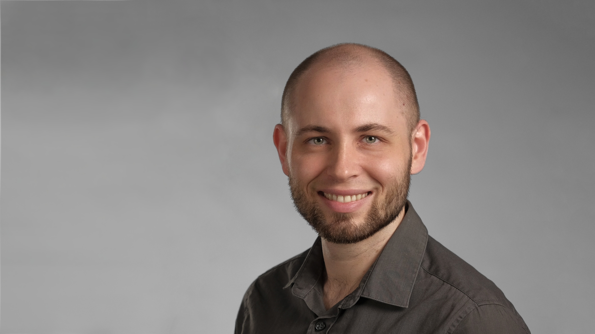

Mein Name ist Dr.-Ing. Florian Linscheid und ich bin wissenschaftlicher
Mitarbeiter am Institut für Materials Resource Management an der Universität
Augsburg. Im Juli 2022 habe ich dort unter der Leitung von Prof. Dr. <a
href="https://www.uni-augsburg.de/de/fakultaet/mntf/mrm/prof/mech/team/sause/"
target="_blank">Markus Sause</a> meine Promotion abgeschlossen, bei der es um
die Kombination mehrerer akustischer Methoden zur Zustandsüberwachung in einem
gemeinsamen Sensornetzwerk ging. Dafür hatte ich einen neuen Ultraschallsensor
entwickelt, der in der Lage ist, diese verschiedenen Methoden zu messen und ein
MATLAB-Software-Framework erstellt, um ein Echtzeit-Überwachungssystem für die
Zustandsüberwachung von Industrieanlagen, insbesondere von Fräsmaschinen, zu
ermöglichen.

Ich konnte zeigen, dass die Kombination von verschiedenen Messmethoden in einem
einzigen Sensornetzwerk eine effektive Möglichkeit darstellt, eine
kostengünstige und umfassende Zustandsüberwachung für Bauteile, Prozesse und
Werkzeuge durchzuführen, was in dieser Form bisher nicht möglich war. Durch die
Reduktion auf einen einzigen Sensortyp für unterschiedliche Messmethoden wird
auch der Anreiz für die Überführung in die praktische Anwendung erhöht.

Derzeit bin ich weiter als Post-Doc in der Arbeitsgruppe „Zustandsüberwachung“
tätig, in dem unser Team verschiedene Projekte bearbeitet, bei denen aus
Maschinen- und Sensordaten Informationen über den Prozess des CNC-Fräsen,
Reibrührschweißen oder den Harzinfiltrationsprozess gewonnen werden.

## Erfahrungen

### Ausbildung

- seit 08/2022: **Post-Doc**, <a
  href="https://www.uni-augsburg.de/de/fakultaet/mntf/mrm/prof/mech/team/linscheid/"
  target="_blank">Mechanical Engineering</a>, Universität Augsburg
- 10/2017 -- 07/2022: **Doktorand**, <a
  href="https://www.uni-augsburg.de/de/fakultaet/mntf/mrm/prof/mech/team/linscheid/"
  target="_blank">Mechanical Engineering</a>, Universität Augsburg
  - Titel: *Entwicklung eines Zustandsüberwachungssystems durch Kombination von
    akustischen Überwachungsverfahren*
- 04/2015 -- 09/2017: **M. Sc. Physik**, Universität Augsburg
	- Titel: *Finite-Elemente-Modellierung von zyklischen
	  Faser-Push-Out-Versuchen*
- 10/2011 -- 09/2014: **B. Sc. Physik**, Universität Augsburg

### Curriculum Vitæ
[CV Florian Linscheid (PDF)](CV_Linscheid.pdf)

### Skills


  
  
  
  
  
  
  
  
  
  
  
  
  
  
  
  


---

## Veröffentlichungen
### 2022
- Florian F. Linscheid. 2022. **Entwicklung eines Zustandsüberwachungssystems
  durch Kombination von akustischen Überwachungsverfahren**. *Dissertation*.
  Universität Augsburg.
- Marcel Achzet, Thomas Schlecht, Florian F. Linscheid, Jan Faber und Markus G.
  R. Sause. 2022. **Ultraschallbasierte Prozessüberwachung am Beispiel eines
  T-RTM Prozesses.** In *DGZfP-Jahrestagung 2022, Kassel, 23.-25. Mai 2022.*
  DGZfP -- Gesellschaft für Zerstörungsfreie Prüfungen e.V.

### 2021
- Markus G. R. Sause, Florian F. Linscheid, Christian Oblinger, Sebastian O.
  Gade und Sinan Kalafat. 2021. **Hard- and software fusion for process monitoring
  during machining of fiber reinforced materials.** In *Proceedings of the
  Munich Symposium on Lightweight Design 2020.* Springer, Berlin, 58-62. DOI:
  [10.1007/978-3-662-63143-0_6]( https://doi.org/10.1007/978-3-662-63143-0_6)
- Florian F. Linscheid und Markus G. R. Sause. 2021. **Hard- und Softwarefusion von
  mehreren akustischen Messmethoden zur Zustandsüberwachung**. In *DGZfP
  Jahrestagung 2021 (virtuell).* Deutsche Gesellschaft für Zerstörungsfreie
  Prüfung (DGZfP), Berlin, 1-8
- Jan Faber, Michael Vistein, Alexander Chaloupka, Marcel Achzet, Florian F.
  Linscheid, Samet Kurt und Markus G. R. Sause. 2021. **Sensor-based process
  monitoring of in-situ polymerization in T-RTM manufacturing with
  caprolactam.** In *Proceedings of the SAMPE Europe 21 Conference, Baden /
  Zürich, Switzerland.* SAMPE, Diamond Bar, CA

### 2019
- Florian F. Linscheid, Sebastian Schwägerl und Markus G. R. Sause. 2019.
  **Evaluierung der Kombination von Schallemissionsanalyse und Prüfung mit
  geführten Wellen in einem gemeinsamen Sensornetzwerk.** In *22. Kolloquium
  Schallemission und 3. Anwenderseminar Zustandsüberwachung mit geführten
  Wellen.* Karlsruhe, Germany.
- Florian F. Linscheid, Tobias Peter, Christian Holzmann und Markus G. R. Sause.
  2019. **Evaluierung eines Überwachungsszenarios durch Kombination von
  akustischen Zustandsüberwachungsmethoden in einem gemeinsamen
  Sensornetzwerk**. In *DACH-Jahrestagung 2019: Zerstörungsfreie
  Materialprüfung*. Deutsche Gesellschaft für Zerstörungsfreie Prüfung (DGZfP),
  Berlin

### 2018
- Markus G. R. Sause, Florian F. Linscheid und Markus Wiehler. 2018. **An
  experimentally accessible probability of detection model for aboustic emission
  measurements.** In *Journal of Nondestructive Evaluation 37, 2, 37:17.* DOI:
  [10.1007/s10921-018-0474-4](https://doi.org/10.1007/s10921-018-0474-4)

### 2016
- Judith Moosburger-Will, Jan Jäger, Julia Strauch, Matthias Bauer, Stefan
  Strobl, Florian F. Linscheid und Siegfried R. Horn. 2016. **Interphase
  formation and fiber matrix adhesion in carbon fiber reinforced epoxy resin:
  influence of carbon fiber surface chemistry.** In *Composite Interfaces 24, 7,
  691-710.* DOI:
  [10.1080/09276440.2017.1267513](https://doi.org/10.1080/09276440.2017.1267513)

## Sonstiges

- Ich liebe guten Kaffee ☕️
- Ich habe für meine Rancilio Silvia Espressomaschine eine PID-Steuerung gebaut
  und sie ins Apple Home Netzwerk eingebunden
- Ich habe einen Segelflugschein 🛩

---

## Kontakt
E-Mail : mail@florianlinscheid.de

