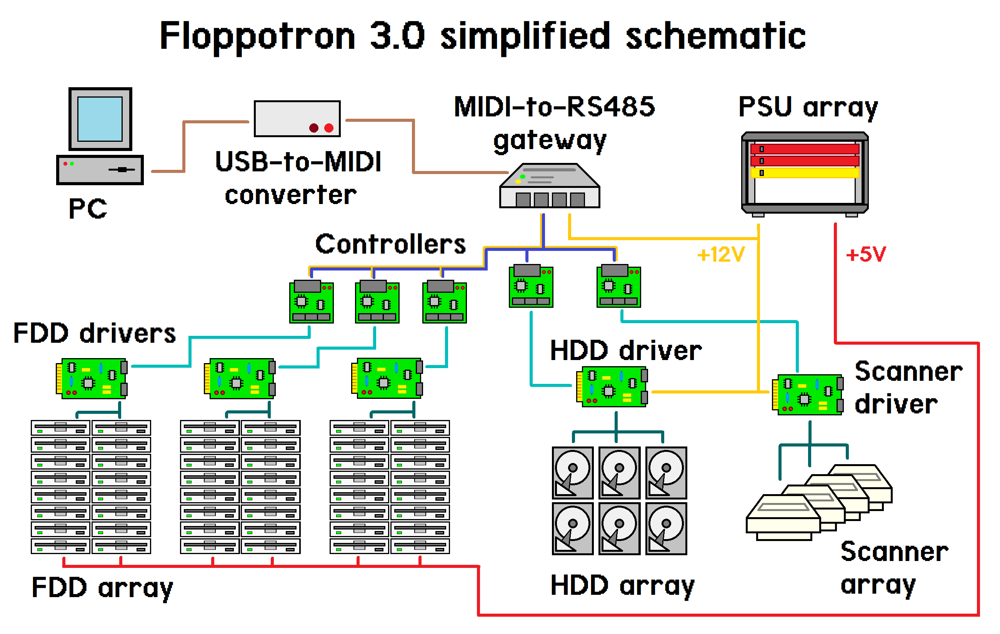
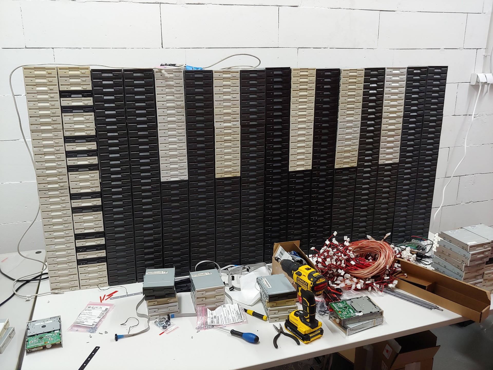

After a long time it’s time for a big upgrade of my computer hardware orchestra. Here it is! The bigger and better Floppotron 3.0. 512 floppy disk drives, 4 scanners and 16 hard disk drives.

My noise-making contraption grew a little bit since last update. It has its own „studio” space and became a relatively complex device. There is a ton of cables, a lot of custom electronic circuits, but the whole power is in the firmware which has been rewritten from scratch. In this article I’ll try to explain the principle of operation, how it’s built, how the whole system works, what’s still missing, provide some more technical details for nerds and answer the most commonly asked questions.

## So how does it all work?
To avoid scaring the non-technical readers away at the beginning, I’ll start with the basic operating principles and explain where these sounds come from. Every mechanical device with electric motor or any other moving parts makes noise as a side effect. Sometimes that noise can be controlled. and turned into music – which usually involves some level of abuse. All of the devices present in the „orchestra” contain either stepper motors or moving heads (in case of hard drives), which are driven by custom electronic circuits – controllers. Those controllers are connected in a network and can be commanded from the computer to make a specific device (e.g. scanner #2) emit a specific sound (e.g. constant 440hz tone which corresponds to A4 note in music) at a specific point in time. A sequence of those noises and tones makes music – just like with the real instruments. Sounds simple? In principle, yes, but it gets complicated in a larger scale.

### How it’s done?
The machine evolved into a relatively large system with multiple custom circuit boards and 3D-printed parts. While making the new Floppotron, one of the main priorities (if not the main) was finishing it in reasonable time. It’s still a hobby project made after hours and not something commercial or mass produced, so you will find some nice solution as well as some janky, quick-and-dirty ones – and that’s the beauty of hobby projects. Let’s get a little more technical. To explain how the system works, I’ll go through the overview first and then will get into details of each individual block. Here’s a simplified schematic od the machine.

To make the old computer hardware play, we need a set of electronic controllers mentioned before but also a proper music (musical sequence) to play. A melody is encoded as a sequence od MIDI events, the same format as all digital synthesizers use. MIDI does not carry any actual audio data, but just short events, like pressing a piano key or twisting a control knob – you can think of it as a digital form of sheet music. Those events are send from the computer to the gateway using USB to MIDI adapter. The gateway is a custom nRF52 microcontroller based device which sits between the PC with MIDI adapter and the network of „instrument” controllers. It receives MIDI data and converts that data to RS-485-based internal protocol which can encapsulate MIDI and some extra stuff. The gateway, protocol and reasoning is described in further section. Those messages are picked by controllers which will turn the digital information into a sound by driving the electric motors or moving the hard disk heads. The controller consists of a common MCU board with Nordic nRF52832 chip and a driver boards specific to the „instrument”, like floppy drive string, flatbed scanner or a hard drive. If you’re wandering why there is a Bluetooth-enabled chip – I’ll explain it too, but let’s talk about how the sound is created first.

### Floppy disk drive wall
A floppy disk contains a magnetic disk inside which is read and written by the drive (FDD). The data is stored by the magnetic head being moved over the spinning disk surface which incorporates two motors. One in the middle of the drive which spins the disk around and a second one driving the linear mechanism which slides the head across the disk radius. It’s the latter, stepper motor which makes that specific FDD seek sound. The head assembly is moved back and forth in small steps and each of those steps make a click. If the step rate is high enough, it is perceived as a constant tone with its pitch depending on movement speed.

The controller software takes care of driving multiple disk drives at once to step its heads with requested frequency. There is also one more thing which makes it sound good and more natural – it’s the sound envelope simulation. The drives are grouped in columns by the software and the whole column can only play one tone at a time, but with varying number of drives playing. By changing the number of active drives I can make the tone volume change over time and mimic piano keystrokes or plucking guitar string which volume decays exponentially. The envelope can also be used to get other nice sounding effects, like vibration (sinusoidal envelope), etc.
Driving a single FDD is easy, as it provides a simple digital interface to control the head position on its 34-pin connector. To move the head, only 3 signals are required – EN (enable), DIR (direction) and STEP. The head step is performed on falling edge of STEP signal in a direction selected by DIR pin state, provided that EN is active (logical „0″), which also lights the LED on the front of a drive. Connecting and driving a larger amount of drives makes it a little more complicated.

To connect that many drives, I made a set of daisy-chained adapter boards containing buffers and shift registers (driven with SPI) providing more outputs. Generating the signal sequences for that many drives is tricky, but I was able to get a pretty god performance with some programming tricks and by using PPI (a special peripheral present in Nordic chips) to offload a signifiant part of the signal generation from the CPU. In current configuration, one controller drives up to 192 drives, so I’m using 3 controllers to drive 512 FDDs. More drives per controller is still possible with some further optimization (to keep the satisfying timing resolution), but it’s not really needed at this point.

The FDD wall is made of 8-drive blocks tied together with 3D-printed rails. Every block has one adapter (assembled in local SMT manufacturing facility) plugged into the first drive. The remaining seven drives are connected to the adapter outputs with hand-made cables terminated with Dupont connectors. The cabling was the most tedious part. I was planning to order such cables in a local factory, but due to lead time exceeding a couple of month I decided to go a quick-and-dirty way. I have ordered a bag of so-called rainbow cables in hobby shop, removed the 1×1 plastic connectors with a knife ((512 – 64) drives * 4 wires * 2 sides!) and put the larger 2-row connectors. I was also initially experimenting with a multiple IDC 2,54 connectors on a single ribbon cable (to avoid cable mess like in previous FLoppotron) – it went pretty good, but required assembly of tinny PCB adapter for every drive which would also increase time and costs. I went with the solution which maybe does not look that cool, but was faster, hassle-less, and cheaper. I couldn’t find any pre-made cables for FDD power, so I had to make those cables and crimp the connectors by hand. Every stack of drives has a 3D printed base which holds the controllers and power boards with resettable fuse. There is one dedicated resettable fuse with indicator LED per each 8-drive block, so failing (shorting) drive with shutdown the block until the short is removed. That protects the cables and makes the replacements of (up to 30-year old) failed drives easier – which, by the way, do fail occasionally. Plastic base with thin plastic rails is not the sturdiest construction, but that will do for now.

### Flatbed scanners
The floppy disk drives do a good job playing low pitch tones, but does not handle high notes well. It’s a task for flatbed scanner motors. They have larger motors and can play higher pitch sounds. To drive the scanner motors, I have build a prototype driver using one of my previous prototype output boards combined with off-the-shelf H-bridge modules mounted on a 3D-printed frame. There are four old HP scanners, almost identical as the larger on in Floppotron 2.0 – it took me quite a bit to hunt them on eBay and local Polish advertisement sites. At the moment, it works in the same way as in the previous Floppotron – the controller moves the scanner head assembly using stepper motor with varying speed and alternating direction to avoid bumping against the chassis. It still does not have endstop switches and cannot automatically position itself in the center on power-up – that’s something I want to implement in the next hardware update.

However, there are two new features. The first one is the nice looking, neon-like silicon RGB LED strip mounted on each scanner head. In addition to aesthetics, it helps in identifying which device is actually playing which section by pulsing with the notes. The strips are press-fitted into a 3D-printed rails replacing a part of metal housing and scanner mirror assembly. The second new feature comes with the entirely new software and MIDI support – pitch and modulation effects has been improved. Now the scanners can make even more weird sounds.

### Hard disk drives
The clicking sound of the hard disks is produced by energizing the coil in the magnetic head assembly. That head is effectively a speaker – but unlike in case of speakers, the element being moved is an arm with magnetic read/write head instead of a speaker cone. In normal operation, the head is moved back and forth over disk platters within the safe operating region. When pushed too far, it will hit the boundary and make a loud click – something you really don’t want to happen with a live hard drive storing your data.

Some time ago I bought a couple of small lots of random old hard drives on eBay-like services. Every drive model has slightly different mechanics, has a different metal casing and therefore make a different sound when abused. To make the set of hard disks sound a little more like a drumset, I had test each drive and sort them by sound they make. Some drives make a bassy „clack”, some of them make higher „bang” and some of them sound like a bell. Each one of 16 drives in current setup has been assigned to a closest General MIDI drum sound it can mimic, e.g. kick drum, snare or closed hi-hat.

Unlike the scanner controller, the hard disk controller is more complete. The controller is a bundle of boards tied with wires and 3D-printed prototype frames. There is a single common controller board with dedicated software (as in all other controllers), and a chain of custom H-driver boards in pair with off-the-shelf voltage regulator board (with a cheap clone of LM2576/LM2596/etc) – one pair per every group of 4 drives.

To connect HDD heads I have used modular 6p6c (RJ12) connectors (which are very common and easy to crimp) and a flat 6-conductor phone cable I had laying around. It’s not the best way to carry power due to its thin wires and high resistance, but it’s way thinner by common UTP cable and running 16 of those on a table look way more clean. Aesthetics are also important in this kind of project, so if it works – it’s good enough. Every hard disk has been equipped with a tiny hand-soldered board containing RGB LED and a cable connector. As with scanners, the flashing LEDs help identify which drives are playing.

